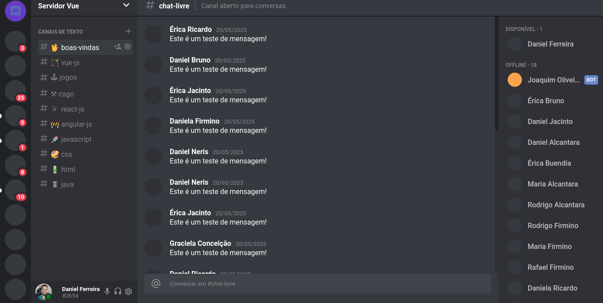

# Clonando a interface do Discord com Vue, HTML e CSS

### Projeto feito com intuito de praticar HTML e CSS usando components feitos em Vue

### O que aprendi/pratiquei:
* CSS Grid
* Sass
* Renderização condicional



> Create discord interface using vue technologies

## Build Setup

``` bash
# install dependencies
npm install

# serve with hot reload at localhost:8080
npm run dev

# build for production with minification
npm run build
```

For detailed explanation on how things work, consult the [docs for vue-loader](http://vuejs.github.io/vue-loader).
